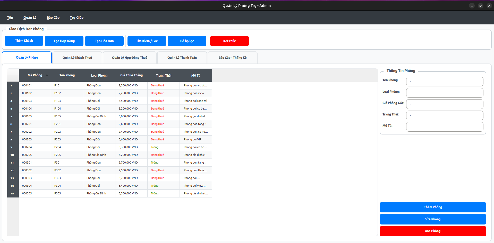
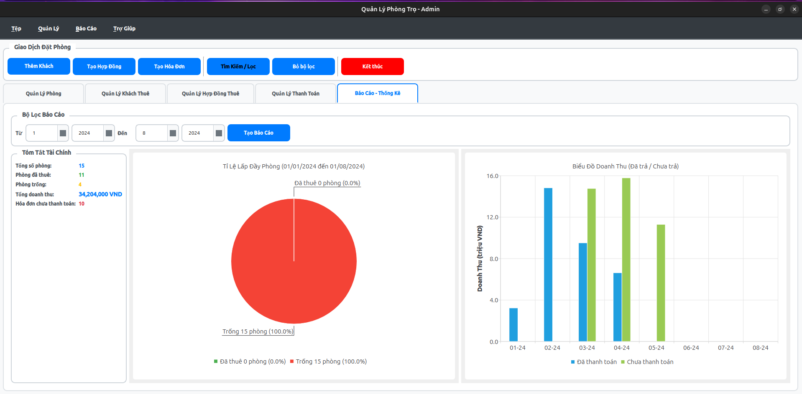

# 🏠 PBL 02 - Ứng Dụng Quản Lý Khu Trọ

[](https://isocpp.org/)
[](https://www.qt.io/)
[](LICENSE)

> **Dự án cơ sở lập trình** - Xây dựng phần mềm quản lý khu trọ hiện đại với giao diện thân thiện

## 📋 Giới Thiệu

**Ứng dụng Quản Lý Khu Trọ** là một phần mềm desktop được phát triển bằng **C++** và **Qt5**, giúp chủ khu trọ quản lý hiệu quả mọi hoạt động kinh doanh. Ứng dụng cung cấp giải pháp toàn diện để quản lý phòng trọ, người thuê, hợp đồng, dịch vụ và hóa đơn thanh toán, kèm theo các tính năng thống kê và báo cáo trực quan.

### ✨ Tính Năng Chính

#### 🏢 Quản Lý Phòng Trọ
- Thêm, sửa, xóa thông tin phòng
- Theo dõi trạng thái phòng (trống/đang thuê)
- Phân loại phòng: đơn, đôi, gia đình
- Quản lý giá thuê và mô tả chi tiết

#### 👥 Quản Lý Người Thuê
- Lưu trữ thông tin đầy đủ: họ tên, CMND/CCCD, số điện thoại
- Theo dõi ngày sinh, giới tính
- Tìm kiếm và lọc người thuê nhanh chóng
- Quản lý nhiều người thuê trong một phòng

#### 📜 Quản Lý Hợp Đồng
- Tạo hợp đồng thuê phòng chi tiết
- Gắn nhiều người thuê vào một hợp đồng
- Theo dõi ngày bắt đầu, ngày kết thúc
- Quản lý tiền cọc và trạng thái hợp đồng

#### 💰 Quản Lý Hóa Đơn
- Tạo hóa đơn thanh toán tự động theo tháng
- Tính toán tổng tiền (tiền phòng + dịch vụ)
- Theo dõi trạng thái thanh toán
- In và xuất hóa đơn

#### ⚙️ Quản Lý Dịch Vụ
- Quản lý các loại dịch vụ: điện, nước, internet, rác, v.v.
- Cập nhật đơn giá và đơn vị tính
- Ghi nhận số lượng sử dụng
- Tự động tính tiền dịch vụ

#### 📊 Thống Kê & Báo Cáo
- Biểu đồ thống kê doanh thu theo tháng
- Phân tích tỷ lệ phòng trống/đã thuê
- Báo cáo chi tiết về hóa đơn và thanh toán
- Giao diện biểu đồ trực quan với Qt Charts

#### 🔒 Bảo Mật
- Hệ thống xác thực người dùng
- Mã hóa dữ liệu nhạy cảm
- Phân quyền quản lý

## 🖼️ Giao Diện Ứng Dụng

### Màn Hình Quản Lý Chính

*Giao diện quản lý phòng, người thuê và hợp đồng*

### Biểu Đồ Thống Kê

*Biểu đồ phân tích doanh thu và tình hình kinh doanh*

## 🛠️ Công Nghệ Sử Dụng

| Công Nghệ | Mô Tả |
|-----------|-------|
| **Ngôn ngữ** | C++17 |
| **Framework** | Qt5 (QtCore, QtWidgets, QtGui, QtCharts) |
| **Build System** | Make/pkg-config |
| **UI Design** | Qt Designer (.ui files) |
| **Platform** | Linux (Ubuntu/Debian/Arch/Fedora) |
| **Storage** | File-based database (.dat files) |

## 📁 Cấu Trúc Dự Án

```text
PBL02/
├── main.cpp                    # Entry point của ứng dụng
├── Makefile                    # Build configuration
├── README.md                   # Tài liệu dự án
├── INSTALL.md                  # Hướng dẫn cài đặt
├── uic.sh                      # Script compile UI files
├── note.todo                   # Development notes
│
├── bin/                        # Output binaries
│   └── main                    # Executable file
│
├── app/                        # Source code chính
│   ├── database/               # Database structure & docs
│   │   └── _structure.md       # Database schema documentation
│   │
│   ├── include/                # Header files
│   │   ├── QuanLy.h           # Main application controller
│   │   ├── Core/              # Core utilities
│   │   │   ├── cVector.h      # Custom vector implementation
│   │   │   ├── ExtraFormat.h  # String formatting utilities
│   │   │   ├── Manager.h      # Base manager class
│   │   │   ├── PrimaryKey.h   # Primary key generator
│   │   │   └── Setting.h      # Application settings
│   │   ├── Data/              # Data models
│   │   │   ├── Bill.h         # Hóa đơn
│   │   │   ├── Contract.h     # Hợp đồng
│   │   │   ├── Rent.h         # Quan hệ thuê
│   │   │   ├── Room.h         # Phòng trọ
│   │   │   ├── Service.h      # Dịch vụ
│   │   │   ├── ServiceType.h  # Loại dịch vụ
│   │   │   └── Tenant.h       # Người thuê
│   │   ├── Dialogs/           # UI Dialogs
│   │   │   ├── AddBillDiag.h
│   │   │   ├── AddContractDiag.h
│   │   │   ├── AddRoomDiag.h
│   │   │   ├── AddTenantDiag.h
│   │   │   └── SearchFilterDiag.h
│   │   ├── Manager/           # Business logic managers
│   │   │   ├── BillManager.h
│   │   │   ├── ContractManager.h
│   │   │   ├── DataManager.h  # Main data coordinator
│   │   │   ├── RentManager.h
│   │   │   ├── RoomManager.h
│   │   │   ├── ServiceManager.h
│   │   │   ├── ServiceTypeManager.h
│   │   │   └── TenantManager.h
│   │   ├── Secure/            # Authentication & Security
│   │   │   └── Authentication.h
│   │   └── Widgets/           # Custom widgets
│   │       ├── QChartBC.h     # Bar chart widget
│   │       ├── QChartPie.h    # Pie chart widget
│   │       └── QServiceWidget.h
│   │
│   └── sources/               # Implementation files
│       └── [mirrors include/ structure]
│
├── ui/                        # UI definitions
│   ├── design/                # Qt Designer files
│   │   ├── add_bill.ui
│   │   ├── add_contract.ui
│   │   ├── add_room_dialog.ui
│   │   ├── add_tenant_dialog.ui
│   │   ├── admin_main.ui
│   │   └── search_filter_dialog.ui
│   └── uics/                  # Generated UI headers
│       └── [auto-generated .h files]
│
└── demo/                      # Screenshots & demos
    ├── quanly.png            # Management screen
    └── sodo.png              # Statistics chart
```

## 🗄️ Cơ Sở Dữ Liệu

Ứng dụng sử dụng hệ thống lưu trữ file-based với các file `.dat`:

### Entities

| Entity | File | Mô Tả |
|--------|------|-------|
| **Room** | `rooms.dat` | Thông tin phòng trọ |
| **Tenant** | `tenants.dat` | Thông tin người thuê |
| **Contract** | `contracts.dat` | Hợp đồng thuê phòng |
| **Bill** | `bills.dat` | Hóa đơn thanh toán |
| **Service** | `services.dat` | Dịch vụ sử dụng |
| **ServiceType** | `service_types.dat` | Loại dịch vụ |
| **Rent** | `rents.dat` | Quan hệ Tenant-Contract |

### Enumerations

**Room Type:**
- `0`: Phòng đơn
- `1`: Phòng đôi
- `2`: Phòng gia đình

**Room Status:**
- `0`: Trống
- `1`: Đang thuê

**Gender:**
- `0`: Không xác định
- `1`: Nam
- `2`: Nữ

**Contract Status:**
- `0`: Đã kết thúc
- `1`: Đang hoạt động

**Payment Status:**
- `0`: Chưa thanh toán
- `1`: Đã thanh toán
- `2`: Vô hiệu hóa

Chi tiết về cấu trúc database: [app/database/_structure.md](app/database/_structure.md)

## 🚀 Bắt Đầu

### Yêu Cầu Hệ Thống

- **OS:** Linux (Ubuntu 20.04+, Debian 10+, Fedora 30+, Arch Linux)
- **Compiler:** GCC 7+ hoặc Clang 6+ (hỗ trợ C++17)
- **Qt:** Qt5.12 hoặc cao hơn
- **Memory:** Tối thiểu 512MB RAM
- **Disk:** 50MB trống

### Cài Đặt

#### 1️⃣ Cài Đặt Dependencies

**Ubuntu/Debian:**
```bash
sudo apt update
sudo apt install -y qt5-default qtbase5-dev libqt5charts5-dev build-essential pkg-config
```

**Fedora/RHEL/CentOS:**
```bash
sudo dnf install -y qt5-qtbase-devel qt5-qtcharts-devel
sudo dnf groupinstall "Development Tools"
```

**Arch/Manjaro:**
```bash
sudo pacman -S qt5-base qt5-charts base-devel pkg-config
```

Xem chi tiết: [INSTALL.md](INSTALL.md)
Hoặc: [Hướng Dẫn Cài Đặt PDF](HuongDanCaiDat.pdf))

#### 2️⃣ Clone Repository

```bash
git clone <repository-url>
cd PBL02
```

#### 3️⃣ Compile UI Files

```bash
chmod +x uic.sh
./uic.sh
```

#### 4️⃣ Build Ứng Dụng

```bash
make
```

#### 5️⃣ Chạy Ứng Dụng

```bash
make run
# hoặc
./bin/main
```

### Build Commands

```bash
# Build project
make

# Clean build files
make clean

# Build và chạy
make run
```

## 📖 Hướng Dẫn Sử Dụng

### 1. Xác Thực Đăng Nhập
- Khởi động ứng dụng
- Hệ thống Authentication sẽ yêu cầu xác thực
- Nhập thông tin đăng nhập để tiếp tục

### 2. Quản Lý Phòng Trọ
- **Thêm phòng:** Click nút "Thêm phòng" → Điền thông tin → Lưu
- **Sửa phòng:** Double-click vào phòng → Chỉnh sửa → Lưu
- **Xóa phòng:** Chọn phòng → Click "Xóa" → Xác nhận
- **Tìm kiếm:** Sử dụng thanh tìm kiếm và filter

### 3. Quản Lý Người Thuê
- **Thêm người thuê:** Điền đầy đủ thông tin (Họ tên, CMND, SĐT, Ngày sinh, Giới tính)
- **Xem chi tiết:** Click vào người thuê để xem lịch sử thuê
- **Chỉnh sửa:** Double-click để sửa thông tin
- **Tìm kiếm:** Tìm theo tên, CMND hoặc số điện thoại

### 4. Tạo Hợp Đồng
- Chọn phòng còn trống
- Chọn người thuê (có thể chọn nhiều người)
- Điền thông tin:
  - Ngày bắt đầu, ngày kết thúc
  - Tiền thuê hàng tháng
  - Tiền đặt cọc
  - Ghi chú (nếu có)
- Lưu hợp đồng

### 5. Quản Lý Hóa Đơn
- **Tạo hóa đơn:** Chọn hợp đồng → Chọn tháng → Nhập dịch vụ sử dụng
- **Dịch vụ:** Điện, nước, internet, rác (số lượng × đơn giá)
- **Xem tổng tiền:** Hệ thống tự động tính = Tiền phòng + Tổng dịch vụ
- **Thanh toán:** Đánh dấu "Đã thanh toán" khi hoàn tất

### 6. Xem Thống Kê
- Truy cập tab "Thống kê"
- **Biểu đồ cột:** Doanh thu theo tháng
- **Biểu đồ tròn:** Tỷ lệ phòng trống/đã thuê
- **Bộ lọc:** Chọn khoảng thời gian để xem chi tiết

## 🎯 Kiến Trúc

### Design Pattern

- **MVC (Model-View-Controller):** Tách biệt logic và UI
- **Manager Pattern:** Quản lý tập trung cho từng entity
- **Singleton:** DataManager làm điểm truy cập duy nhất

### Core Components

```cpp
DataManager          // Coordinator chính
├── RoomManager      // Quản lý phòng
├── TenantManager    // Quản lý người thuê
├── ContractManager  // Quản lý hợp đồng
├── BillManager      // Quản lý hóa đơn
├── ServiceManager   // Quản lý dịch vụ
└── ServiceTypeManager // Quản lý loại dịch vụ
```

### Data Flow

```
UI (QuanLy) → Manager → Data Model → File Storage (.dat)
```

## 🔧 Development

### Compile UI Files

```bash
# Convert .ui to .h
./uic.sh

# hoặc thủ công
uic ui/design/admin_main.ui -o ui/uics/admin_main.h
```

### Debug Mode

```bash
# Compile with debug symbols
make clean
make CXXFLAGS="-g -Wall -std=c++17"

# Run with GDB
gdb ./bin/main
```

### Code Style

- **Standard:** C++17
- **Naming:**
  - Classes: PascalCase (`RoomManager`)
  - Functions: camelCase (`getRoomName()`)
  - Variables: camelCase (`roomId`)
  - Constants: UPPER_SNAKE_CASE (`MAX_ROOMS`)
- **Indentation:** 4 spaces

## 🐛 Troubleshooting

### Lỗi biên dịch: "Qt headers not found"

```bash
# Kiểm tra Qt installation
pkg-config --modversion Qt5Core

# Nếu không tìm thấy, cài đặt lại Qt5
sudo apt install qtbase5-dev
```

### Lỗi: "cannot open display"

```bash
# Chạy trên server không có GUI
export DISPLAY=:0
# hoặc sử dụng VNC/X11 forwarding
```

### Database file corrupted

```bash
# Backup và reset database
mkdir backup
mv app/database/*.dat backup/
# Chạy lại ứng dụng để tạo database mới
```

### Segmentation fault khi chạy

```bash
# Kiểm tra với valgrind
valgrind --leak-check=full ./bin/main
```

## 🤝 Contributing

Contributions are welcome! Please follow these steps:

1. Fork the project
2. Create your feature branch: `git checkout -b feature/AmazingFeature`
3. Commit your changes: `git commit -m 'Add some AmazingFeature'`
4. Push to the branch: `git push origin feature/AmazingFeature`
5. Open a Pull Request

## 📝 Roadmap

- [x] Hệ thống xác thực người dùng
- [x] Mã hóa dữ liệu nhạy cảm
- [x] Custom Vector để lưu trữ dữ liệu
- [x] Thống nhất ngôn ngữ UI
- [ ] Tính năng tìm kiếm nâng cao
- [ ] Xuất báo cáo PDF
- [ ] Backup/Restore database
- [ ] Multi-user support

## 📄 License

This project is licensed under the MIT License - see the [LICENSE](LICENSE) file for details.

## 👥 Đội Ngũ Phát Triển

**PBL02 Development Team - Năm học 2025-2026**

| Thành Viên | MSSV | Vai Trò |
|-----------|------|---------|
| **Võ Phi Nhật Huy** | 102240139 | Project Lead & Backend Developer & Database Architect & UI/UX Designer|
| **Hồ Đức Việt** | 102240175 | Tester |

## 🙏 Acknowledgments

- **Qt Framework** - Cross-platform application development framework
- **C++ Standard Library** - Core language support
- **University PBL Program** - Project-based learning opportunity
- All contributors and testers who helped improve this project

## 📚 Tài Liệu Liên Quan

- [Hướng dẫn cài đặt chi tiết](INSTALL.md)
- [Cấu trúc cơ sở dữ liệu](app/database/_structure.md)
- [Qt5 Documentation](https://doc.qt.io/qt-5/)
- [C++17 Standard](https://en.cppreference.com/w/cpp/17)

---

<div align="center">

### 🎓 Dự Án Cơ Sở Lập Trình (PBL 02)

**Học kỳ I - Năm học 2025-2026**

*Built with ❤️ for learning and practical experience*

**© 2025-2026 PBL02 Team**

</div>
